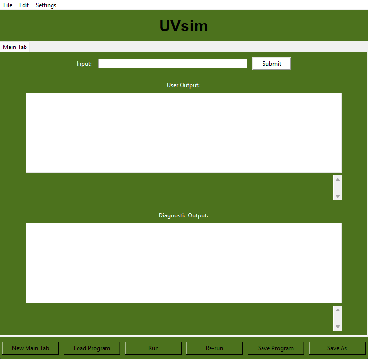
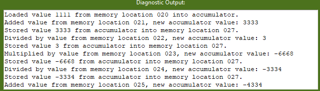
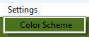
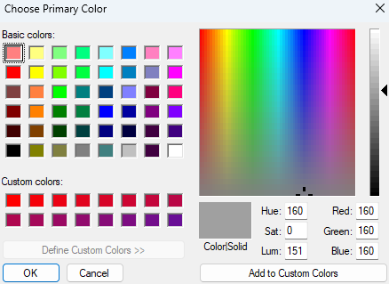

# Documentation for UVSim Project


### Introduction / Executive Summary

The **UVSim** project is a software simulation tool designed to assist computer science users in learning and understanding fundamental concepts of machine language and computer architecture. Developed with educational purposes in mind, UVSim offers a simplified virtual machine environment where users can write, load, and execute programs written in a custom machine language called BasicML. This language closely mimics the operations and functionalities of a real-world CPU, providing an interactive and practical learning experience.

UVSim features a user-friendly graphical interface that allows users to interact with the virtual machine intuitively. The simulator supports key functionalities such as reading input, performing arithmetic operations, and executing control flow instructions, which mimic the behavior of an actual computer processor. By utilizing UVSim, users gain hands-on experience in programming at the machine level, offering them a deeper understanding of how computers process instructions and manage data.

The project has been developed with flexibility in mind, supporting both four-digit and six-digit instruction formats, allowing users to work with different levels of complexity. Additionally, the simulator is equipped with features that enhance usability, such as customizable color scheme, the ability to handle multiple program files simultaneously, and tools for editing files.

---

---page-break---

## Table of Contents

1. [User Stories](#user-stories)
2. [Use Cases](#use-cases)
3. [UVSim Requirements](#uvsim-requirements)
4. [Class Diagrams/Descriptions](#class-diagramsdescriptions)
5. [Unit Test Documentation](#unit-test-documentation)
6. [Project Workflow](#project-workflow)
7. [UVSim User Manual](#uvsim-user-manual)
   - [Program Initial Setup](#program-initial-setup)
   - [User Interface](#user-interface)

---

## User Stories

#### User Story 1

- **Title:** Load Program
- **Description:** As a computer science student, I want to load a BasicML program into the simulator so that I can test and debug my machine language programs.

#### User Story 2

- **Title:** Run Program
- **Description:** As a computer science student, I want to run a loaded BasicML program so that I can see the results of my machine language instructions.

#### User Story 3

- **Title:** Save Program
- **Description:** As a computer science student, I want to save my BasicML program to a file so that I can edit or run it later without losing my progress.

#### User Story 4

- **Title:** Reset Simulator
- **Description:** As a computer science student, I want to reset the simulator so that I can start fresh with a new program or rerun the current program from the beginning.

#### User Story 5

- **Title:** Edit Program
- **Description:** As a computer science student, I want to edit the loaded BasicML program within the simulator so that I can make changes and correct errors directly.

#### User Story 6

- **Title:** View Output
- **Description:** As a computer science student, I want to view the output of my BasicML program on the simulator's interface so that I can analyze the results of my instructions.

#### User Story 7

- **Title:** Configure Color Scheme
- **Description:** As a computer science student, I want to configure the color scheme of the simulator's interface so that I can personalize the look and feel of the application.

#### User Story 8

- **Title:** Multiple Tabs
- **Description:** As a computer science student, I want to open multiple BasicML programs in different tabs within the simulator so that I can work on and compare multiple programs simultaneously.

#### User Story 9

- **Title:** Cut, Copy, and Paste
- **Description:** As a computer science student, I want to cut, copy, and paste instructions within the BasicML program editor so that I can easily modify and organize my code.

#### User Story 10

- **Title:** Error Handling
- **Description:** As a computer science student, I want the simulator to provide clear error messages when my BasicML program contains mistakes so that I can quickly identify and fix the issues.

#### User Story 11

- **Title:** Branch Operations
- **Description:** As a computer science student, I want to use branch operations (BRANCH, BRANCHNEG, BRANCHZERO) in my BasicML program so that I can control the flow of execution based on specific conditions.

#### User Story 12

- **Title:** Arithmetic Operations
- **Description:** As a computer science student, I want to perform arithmetic operations (ADD, SUBTRACT, MULTIPLY, DIVIDE) in my BasicML program so that I can implement complex calculations.

#### User Story 13

- **Title:** Load Data
- **Description:** As a computer science student, I want to load data values into memory locations so that I can use them in my BasicML program for various calculations.

#### User Story 14

- **Title:** Input from Keyboard
- **Description:** As a computer science student, I want to read input from the keyboard into memory locations so that my BasicML program can interact with the user.

#### User Story 15

- **Title:** Output to Screen
- **Description:** As a computer science student, I want to write output from memory locations to the screen so that my BasicML program can display results to the user.

---

## Use Cases

#### Use Case 1: Load Program

- **Actor:** Computer Science Student
- **Description:** Load a BasicML program into the simulator.
- **Steps:**
  1. The student selects "Load Program" from the GUI.
  2. The student browses and selects the BasicML file from the file dialog.
  3. The selected program is loaded into the simulator's memory.
  4. The program is displayed in the editor area for review and modification.

#### Use Case 2: Run Program

- **Actor:** Computer Science Student
- **Description:** Run the loaded BasicML program.
- **Steps:**
  1. The student selects "Run" from the GUI.
  2. The simulator executes the loaded program.
  3. The output of the program is displayed in the "User Output" area.
  4. Any errors or diagnostic messages are displayed in the "Diagnostic Output" area.

#### Use Case 3: Save Program

- **Actor:** Computer Science Student
- **Description:** Save the current BasicML program to a file.
- **Steps:**
  1. The student selects "Save Program" from the GUI.
  2. The student chooses a location and filename in the file dialog.
  3. The current program is saved to the specified file.

#### Use Case 4: Reset Simulator

- **Actor:** Computer Science Student
- **Description:** Reset the simulator to its initial state.
- **Steps:**
  1. The student selects "Reset" from the GUI.
  2. The simulator clears the current program from memory.
  3. The simulator's registers and memory are reset to their default values.

#### Use Case 5: Edit Program

- **Actor:** Computer Science Student
- **Description:** Edit the loaded BasicML program.
- **Steps:**
  1. The student selects and modifies instructions directly in the editor area.
  2. The student can cut, copy, and paste instructions using the GUI or keyboard shortcuts.
  3. The student saves the changes by selecting "Save Program" or "Save As".

#### Use Case 6: View Output

- **Actor:** Computer Science Student
- **Description:** View the output and diagnostic messages of the program.
- **Steps:**
  1. The student runs the program by selecting "Run" from the GUI.
  2. The program's output is displayed in the "User Output" area.
  3. Any errors or diagnostic messages are displayed in the "Diagnostic Output" area.

#### Use Case 7: Configure Color Scheme

- **Actor:** Computer Science Student
- **Description:** Configure the color scheme of the simulator's interface.
- **Steps:**
  1. The student selects "Settings" from the menu bar.
  2. The student chooses "Color Scheme" from the settings menu.
  3. The student selects the desired primary and off-colors.
  4. The simulator updates the color scheme accordingly.

#### Use Case 8: Multiple Tabs

- **Actor:** Computer Science Student
- **Description:** Open multiple BasicML programs in different tabs.
- **Steps:**
  1. The student selects "New Main Tab" from the GUI.
  2. A new tab is created with a blank program editor.
  3. The student loads or writes a program in the new tab.
  4. The student can switch between tabs to work on different programs.

#### Use Case 9: Cut, Copy, and Paste

- **Actor:** Computer Science Student
- **Description:** Cut, copy, and paste instructions within the BasicML program editor.
- **Steps:**
  1. The student selects instructions in the editor area.
  2. The student uses the GUI or keyboard shortcuts to cut, copy, or paste the selected instructions.
  3. The student saves the changes by selecting "Save Program" or "Save As".

#### Use Case 10: Error Handling

- **Actor:** Computer Science Student
- **Description:** Provide clear error messages when the BasicML program contains mistakes.
- **Steps:**
  1. The student runs the program by selecting "Run" from the GUI.
  2. The simulator detects errors in the program.
  3. Clear error messages are displayed in the "Diagnostic Output" area, indicating the type and location of errors.

#### Use Case 11: Branch Operations

- **Actor:** Computer Science Student
- **Description:** Use branch operations (BRANCH, BRANCHNEG, BRANCHZERO) in the BasicML program.
- **Steps:**
  1. The student writes branch instructions in the program editor.
  2. The student runs the program by selecting "Run" from the GUI.
  3. The simulator executes the branch operations based on the conditions specified.
  4. The program flow changes according to the branch instructions.

#### Use Case 12: Arithmetic Operations

- **Actor:** Computer Science Student
- **Description:** Perform arithmetic operations (ADD, SUBTRACT, MULTIPLY, DIVIDE) in the BasicML program.
- **Steps:**
  1. The student writes arithmetic instructions in the program editor.
  2. The student runs the program by selecting "Run" from the GUI.
  3. The simulator performs the arithmetic operations and updates the accumulator with the results.
  4. The output and diagnostic messages are displayed in their respective areas.

#### Use Case 13: Load Data

- **Actor:** Computer Science Student
- **Description:** Load data values into memory locations.
- **Steps:**
  1. The student writes data values into specific memory locations in the program editor.
  2. The student runs the program by selecting "Run" from the GUI.
  3. The simulator loads the data values into the specified memory locations.
  4. The program executes using the loaded data.

#### Use Case 14: Input from Keyboard

- **Actor:** Computer Science Student
- **Description:** Read input from the keyboard into memory locations.
- **Steps:**
  1. The student writes READ instructions in the program editor.
  2. The student runs the program by selecting "Run" from the GUI.
  3. The simulator prompts the user to enter input values.
  4. The entered values are stored in the specified memory locations.

#### Use Case 15: Output to Screen

- **Actor:** Computer Science Student
- **Description:** Write output from memory locations to the screen.
- **Steps:**
  1. The student writes WRITE instructions in the program editor.
  2. The student runs the program by selecting "Run" from the GUI.
  3. The simulator outputs the values from the specified memory locations to the screen.
  4. The output is displayed in the "User Output" area.

---

## UVSim Requirements:

#### Project Overview

An important and influential educational client has hired your company to develop a software simulator called UVSim for computer science students to learn machine language and computer architecture. Students can execute their machine language programs on the simulator.

#### BasicML Overview

The UVSim is a simple virtual machine that interprets a machine language called BasicML. It includes a CPU, register, and main memory. An accumulator is used for calculations. The UVSim handles words as signed four-digit decimal numbers (+1234, -5678). The UVSim is equipped with a 100-word memory, referenced by location numbers 00 to 99.

##### BasicML Vocabulary

- **I/O Operations:**
  - READ (10): Read a word from the keyboard into memory.
  - WRITE (11): Write a word from memory to the screen.
- **Load/Store Operations:**
  - LOAD (20): Load a word from memory into the accumulator.
  - STORE (21): Store a word from the accumulator into memory.
- **Arithmetic Operations:**
  - ADD (30): Add a word from memory to the accumulator.
  - SUBTRACT (31): Subtract a word from memory from the accumulator.
  - DIVIDE (32): Divide the accumulator by a word from memory.
  - MULTIPLY (33): Multiply a word from memory by the accumulator.
- **Control Operations:**
  - BRANCH (40): Branch to a specific location in memory.
  - BRANCHNEG (41): Branch if the accumulator is negative.
  - BRANCHZERO (42): Branch if the accumulator is zero.
  - HALT (43): Stop the program.

##### Instruction Format

Each instruction is a signed four-digit or 6-digit decimal number. The first two/three digits are the operation code, and the last two/three digits are the operand (memory address).

#### Milestone 1-2 Deliverables

1. **Design Document (20 pts)**

   - Two User Stories
   - 10-15 Use Cases
2. **Working Prototype (40 pts)**

   - Command-line application
   - Input file processing
3. **Unit Tests (30 pts)**

   - Two unit tests per use case (20-30 total)
   - Spreadsheet listing all unit tests
4. **Other Documents (10 pts)**

   - README.txt with usage instructions
   - Meeting reports

#### Milestone 3 Deliverables

1. **Modifications from Previous Milestone (10 pts)**

   - Address feedback and TODO items.
2. **GUI Design Document (10 pts)**

   - Wireframe diagram of the GUI
   - Label and explain all controls
3. **Code Changes (35 pts)**

   - Implement the GUI
   - Ensure functionality matches the command-line version
4. **Class Definition Document (15 pts)**

   - Describe all classes, interfaces, and functions
   - Include input parameters, return values, pre- and post-conditions
5. **Software Requirement Specification (SRS) Documents (20 pts)**

   - Each team member creates an individual SRS document
   - Merge documents into a final team SRS document
6. **Other Documents (10 pts)**

   - Revised README.txt
   - Meeting reports

#### Milestone 4 Deliverables

1. **Revisions To Previous Milestone (10 pts)**

   - Address feedback and TODO items.
2. **New Design Modifications (50 pts)**

   - Branding with configurable color schemes
   - Support for loading, viewing, and editing files in the GUI
   - Save files to user-chosen directories
   - Allow multiple files to be open simultaneously
3. **Design Document Updates (30 pts)**

   - Update all design documents to reflect new features
4. **Other Documents (10 pts)**

   - Meeting reports

### Milestone 5 Functional Changes for Six-Digit Commands

1. **Expand Memory and Word Size**

   - Increase memory to 250 words (addresses 000 to 249)
   - Change word size to six digits
2. **Support Six-Digit Operations**

   - Prepend zero to function codes (e.g., 010 for READ)
3. **Support Both 4-Digit and 6-Digit Files**

   - Convert 4-digit files to 6-digit format
   - Differentiate between file formats
4. **Multiple File Support**

   - Open multiple files simultaneously within the GUI

---

## Class Diagrams/Descriptions

#### 1. color_scheme.py

- **Functionality**: Handles loading, applying, setting, and saving color schemes for the GUI.
- **Libraries Used**: Tkinter, configparser.

#### 2. cpu_class.py

- **Functionality**: Contains the `CPU` class, simulating a simple CPU.
- **Key Features**:
  - Supports instructions: read, write, load, store, add, subtract, divide, multiply, branch, branchneg, branchzero, and halt.
  - Includes overflow checking, an output function, and a reset method.

#### 3. file_operations.py

- **Functionality**: Provides functions for converting 4-digit operations to 6-digit operations, opening a file, converting its content, and saving the content of a text area to a file or as a new file.
- **Libraries Used**: Tkinter, filedialog, messagebox.

#### 4. main.py

- **Functionality**: Initializes and starts the UVSim program by creating instances of `ProgramLoader`, `Simulator`, and `UVsim`, and linking them together.

#### 5. memory_class.py

- **Functionality**: Includes a `Memory` class with methods for reading, writing, and resetting memory, as well as a string representation of the memory contents.

#### 6. program_loader_class.py

- **Functionality**: Contains the `ProgramLoader` class with a method to load a program from a file, converting each line to an integer.

#### 7. simulator_class.py

- **Functionality**: Implements a `Simulator` class.
- **Key Features**:
  - Loads programs into memory.
  - Runs the programs using the `CPU` class.
  - Resets the simulator state.

#### 8. uvsim_gui.py

- **Functionality**: Defines the `UVsim` class for creating a Tkinter-based GUI for the UVSim program.
- **Key Features**:
  - Methods for creating and managing tabs.
  - Loading and saving programs.
  - Running and resetting the simulator.
  - Handling user inputs.
  - Applying color schemes.

---

## Unit Test Documentation

---

#### Test File: `test_cpu.py`

**Purpose**: This file contains unit tests for the `CPU` class, ensuring that the basic operations, arithmetic, branching, and control operations work as expected.

1. **Test Function**: `test_read`

   - **Purpose**: To verify that the `read` method correctly reads a value from the keyboard and stores it in memory.
   - **Input**: `cpu.read(7)`
   - **Expected Output**: Memory at location 7 is set to 1234, and the output function reports "Executed read (opcode 010) on memory location 007: 1234".
2. **Test Function**: `test_write`

   - **Purpose**: To verify that the `write` method correctly writes a value from memory to the output.
   - **Input**: `cpu.write(7)`
   - **Expected Output**: The output function reports "Executed write (opcode 011) on memory location 007: 4321".
3. **Test Function**: `test_load`

   - **Purpose**: To verify that the `load` method correctly loads a value from memory into the accumulator.
   - **Input**: `cpu.load(10)`
   - **Expected Output**: Accumulator is set to 1000, and the output function reports "Loaded value 1000 from memory location 010 into accumulator."
4. **Test Function**: `test_store`

   - **Purpose**: To verify that the `store` method correctly stores the accumulator's value into memory.
   - **Input**: `cpu.store(10)`
   - **Expected Output**: Memory at location 10 is set to 2000, and the output function reports "Stored value 2000 from accumulator into memory location 010."
5. **Test Function**: `test_add`

   - **Purpose**: To verify that the `add` method correctly adds a value from memory to the accumulator.
   - **Input**: `cpu.add(5)`
   - **Expected Output**: Accumulator is updated to 5000, and the output function reports "Added value from memory location 005, new accumulator value: 5000".
6. **Test Function**: `test_subtract`

   - **Purpose**: To verify that the `subtract` method correctly subtracts a value from memory from the accumulator.
   - **Input**: `cpu.subtract(5)`
   - **Expected Output**: Accumulator is updated to 1000, and the output function reports "Subtracted value from memory location 005, new accumulator value: 1000".
7. **Test Function**: `test_divide`

   - **Purpose**: To verify that the `divide` method correctly divides the accumulator's value by a value from memory.
   - **Input**: `cpu.divide(5)`
   - **Expected Output**: Accumulator is updated to 5, and the output function reports "Divided by value from memory location 005, new accumulator value: 5".
8. **Test Function**: `test_divide_by_zero`

   - **Purpose**: To check that dividing by zero is handled correctly.
   - **Input**: `cpu.divide(5)` with memory value set to 0.
   - **Expected Output**: The output function reports "Error: Division by zero".
9. **Test Function**: `test_multiply`

   - **Purpose**: To verify that the `multiply` method correctly multiplies the accumulator's value by a value from memory.
   - **Input**: `cpu.multiply(5)`
   - **Expected Output**: Accumulator is updated to 12, and the output function reports "Multiplied by value from memory location 005, new accumulator value: 12".
10. **Test Function**: `test_branch`

    - **Purpose**: To verify that the `branch` method correctly updates the instruction counter.
    - **Input**: `cpu.branch(20)`
    - **Expected Output**: Instruction counter is set to 20.
11. **Test Function**: `test_branchneg`

    - **Purpose**: To verify that the `branchneg` method correctly updates the instruction counter if the accumulator is negative.
    - **Input**: `cpu.branchneg(15)` with accumulator set to -10.
    - **Expected Output**: Instruction counter is set to 15.
12. **Test Function**: `test_branchzero`

    - **Purpose**: To verify that the `branchzero` method correctly updates the instruction counter if the accumulator is zero.
    - **Input**: `cpu.branchzero(10)` with accumulator set to 0.
    - **Expected Output**: Instruction counter is set to 10.
13. **Test Function**: `test_halt`

    - **Purpose**: To verify that the `halt` method stops the program execution.
    - **Input**: `cpu.halt()`
    - **Expected Output**: The program halts, and the output function reports "Program encountered halt (043) opcode."
14. **Test Function**: `test_overflow`

    - **Purpose**: To verify that the `check_overflow` method handles overflow and underflow correctly in arithmetic operations.
    - **Input**: `cpu.add(5)` with accumulator initially set to 9999.
    - **Expected Output**: Accumulator wraps around correctly with overflow logic and is set to -9996.
15. **Test Function**: `test_execute_instruction_read`

    - **Purpose**: To verify that the `execute_instruction` method handles the `READ` operation correctly.
    - **Input**: `cpu.execute_instruction(100007)`
    - **Expected Output**: Memory at location 7 is set to 1234.
16. **Test Function**: `test_execute_instruction_write`

    - **Purpose**: To verify that the `execute_instruction` method handles the `WRITE` operation correctly.
    - **Input**: `cpu.execute_instruction(110007)`
    - **Expected Output**: The output function reports "Executed write (opcode 011) on memory location 007: 4321".
17. **Test Function**: `test_execute_instruction_invalid_operand`

    - **Purpose**: To verify that the `execute_instruction` method handles invalid operands correctly.
    - **Input**: `cpu.execute_instruction(100250)`
    - **Expected Output**: The output function reports "Error: Invalid operand 250".

---

#### Test File: `test_file_operations.py`

**Purpose**: This file contains unit tests for the file operations such as opening, saving, and converting files.

1. **Test Function**: `test_open_file`

   - **Purpose**: To verify that the `open_file` function correctly reads and converts 4-digit operations to 6-digit operations.
   - **Input**: Simulated file content with 4-digit operations.
   - **Expected Output**: Content is converted correctly to 6-digit format and displayed in the text area.
2. **Test Function**: `test_save_file`

   - **Purpose**: To verify that the `save_file` function correctly saves content from the text area to a file.
   - **Input**: Simulated content in the text area.
   - **Expected Output**: The file is saved with the correct content.
3. **Test Function**: `test_save_file_as`

   - **Purpose**: To verify that the `save_file_as` function correctly saves content to a new file.
   - **Input**: Simulated content in the text area.
   - **Expected Output**: The file is saved under the new name with the correct content.

---

#### Test File: `test_memory.py`

**Purpose**: This file contains unit tests for the `Memory` class, ensuring that memory operations such as reading, writing, and resetting work as expected.

1. **Test Function**: `test_read`

   - **Purpose**: To verify that the `read` method correctly returns the value stored at a specific memory location.
   - **Input**: `memory.read(10)`
   - **Expected Output**: Returns the value stored at memory location 10.
2. **Test Function**: `test_write`

   - **Purpose**: To verify that the `write` method correctly stores a value at a specific memory location.
   - **Input**: `memory.write(10, 1234)`
   - **Expected Output**: Memory at location 10 is set to 1234.
3. **Test Function**: `test_reset`

   - **Purpose**: To verify that the `reset` method correctly resets all memory locations to 0.
   - **Input**: `memory.reset()`
   - **Expected Output**: All memory locations are set to 0.

---

#### Test File: `test_program_loader.py`

**Purpose**: This file contains unit tests for the `ProgramLoader` class, ensuring that programs are loaded correctly from files and converted if necessary.

1. **Test Function**: `test_load_program_from_file`

   - **Purpose**: To verify that the `load_program_from_file` method correctly loads a program from a file.
   - **Input**: A simulated file path with valid content.
   - **Expected Output**: The program is loaded and converted correctly.
2. **Test Function**: `test_load_program_exceeding_limit`

   - **Purpose**: To verify that the `load_program_from_file` method raises an error if the program exceeds the maximum allowed size.
   - **Input**: A simulated file path with more than 250 lines.
   - **Expected Output**: A `ValueError` is raised.

---

## Project Workflow

1. **Initialization**:

   - The `main.py` script initializes the program by creating instances of `ProgramLoader`, `Simulator`, and `UVsim` classes, linking the simulator to the GUI.
2. **Loading Programs**:

   - Users can load a program file through the GUI.
   - The program is read and loaded into memory.
3. **Running Programs**:

   - Users can run the loaded program.
   - The CPU executes instructions sequentially, updating the accumulator and memory as needed, while displaying outputs and diagnostics in the GUI.
4. **User Interaction**:

   - The GUI provides facilities for user input, file management, and viewing outputs and diagnostics.
   - Users can customize the color scheme via the settings.
5. **Simulator Functions**:

   - The simulator can reset its state, load programs, and rerun programs.
   - The CPU performs basic arithmetic and control operations, simulating the execution of a simple computer program.

---

# UVsim User Manual

## Program Initial Setup

1. **Clone the Repository**

   ```sh
   git clone https://github.com/your-username/UVsim.git
   cd UVsim
   ```
2. **Set Up Virtual Environment**

   ```sh
   python -m venv UVsimVenv
   ```
3. **Activate the Virtual Environment**

   ```sh
   UVsimVenv\Scripts\activate  # On Windows
   # For MacOS/Linux use:
   # source UVsimVenv/bin/activate
   ```
4. **Install Requirements**

   ```sh
   pip install -r requirements.txt
   ```

### Running the Application

To start the UVsim GUI, simply run:

```sh
python uvsim_gui.py
```

## User Interface:



#### 1. **Load Program**


- **Description**: Opens a file dialog to load a program into the simulator.
- **Steps**:
  1. Click the **Load Program** button.
  2. Select the program file you want to load from your file system.
  3. The program will be loaded into the simulator's memory.

#### 2. **Save Program**


- **Description**: Opens a file dialog to save the current program from the text area.
- **Steps**:
  1. Click the **Save Program** button.
  2. Choose the location and name for the file to save the current program.
  3. The program will be saved to the specified location.

#### 3. **Save As**


- **Description**: Similar to Save Program, but allows you to specify a new file name or location.
- **Steps**:
  1. Click the **Save Program As** button.
  2. Select the location and enter the name for the new file.
  3. The program will be saved to the new location with the specified name.

#### 4. **Run**


- **Description**: Runs the loaded program in the simulator.
- **Steps**:
  1. Click the **Run** button.
  2. The simulator will execute the loaded program, displaying outputs as defined by the program logic.
     

#### 5. **Apply Color Scheme**



- **Description**: Opens a dialog to apply a color scheme to the GUI.
- **Steps**:
  1. Hover over the **Settings** button then click **Color Scheme**.
  2. Select the desired color scheme from the options provided.
     
  3. The GUI will update to reflect the selected color scheme.

#### 6. **To edit files:**

- Load a program  then make edits in user output field:
- 
- hit  then reload the program again.

---

## Future Road Map for UVSim

#### 1. Cross-Platform Support

- **Description:** Expand UVSim to support multiple platforms, including mobile devices (iOS, Android) and web-based versions.
- **Impact:** Making UVSim accessible on mobile devices and through a web browser would broaden its user base, allowing users to practice machine language and computer architecture on the go, or in environments where a desktop isn't available.
- **Implementation:** Develop mobile and web versions of the UVSim application, ensuring that the user interface (UI) is responsive and optimized for smaller screens. This would involve using technologies like React Native for mobile and a web framework such as Django or Flask for the web version.

#### 2. Advanced Debugging Tools

- **Description:** Integrate advanced debugging tools into the UVSim interface, such as step-by-step execution, breakpoints, and memory inspection.
- **Impact:** These features would significantly enhance the learning experience by allowing users to thoroughly investigate how their machine language programs execute, making it easier to understand why their program may not be functioning as it should.
- **Implementation:** Add UI elements for setting breakpoints and stepping through instructions one at a time. Integrate memory and register inspection views, where users can see the current state of the simulator's memory and registers at any point during execution.

#### 3. Expanded Instruction Set

- **Description:** Introduce a more complex instruction set that includes advanced operations such as bitwise manipulation, stack operations, and input/output handling beyond basic READ/WRITE commands.
- **Impact:** Expanding the instruction set would allow users to learn and experiment with more advanced machine language concepts, making UVSim a more powerful educational tool.
- **Implementation:** Modify the CPU class and related components to support the new instruction set. Update the UI to include documentation and tutorials on how to use these new instructions.
